# GIt笔记

## 一、两种本本控制器

### 1、集中式版本控制器

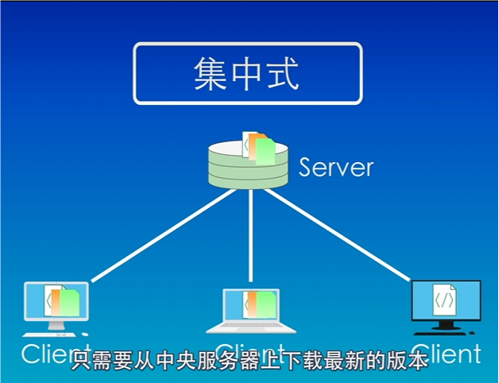

#### 操作：

从中央服务器下载最新版本

修改完成后在上传到中央服务器

#### 优点：

操作简单

#### 缺点：

中央服务器出现问题，所有人工作将无法进行，只能等待服务器恢复运行

### 2、分布式版本控制系统

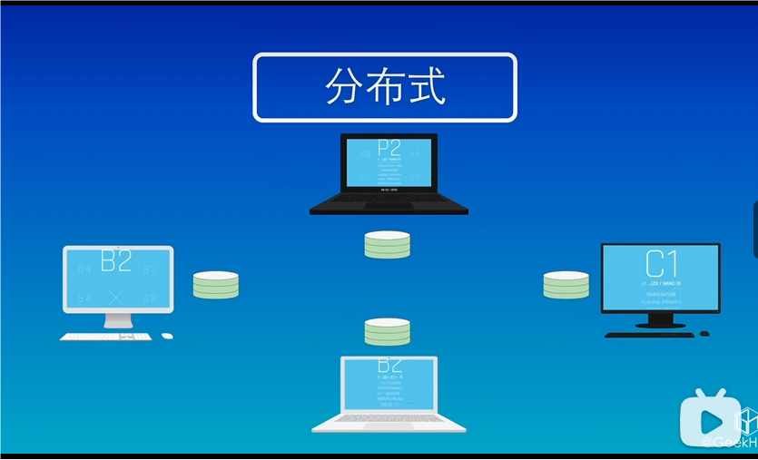

#### 操作：

从中央服务器拉取数据，对数据进行修改，添加到暂存区，提交到本地数据库，推送到中央服务器

#### 优点：

免费开源，速度快，功能强大，支持离线工作以及强大的分支管理的特性

可以在本地进行修改，不需要考虑网络问题

即使中央服务器出现问题，也可以进行工作

#### 缺点：

中央服务器出现问题，所有人工作将无法进行，只能等待服务器恢复运行

## 二、Git安装与配置

### 1、下载安装

#### Git官方网站：

https://git-scm.com/

#### 下载并安装完成：

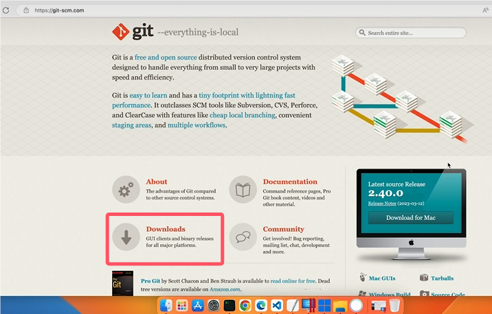

#### 查看Git是否安装成功：

在终端中输入：git -v

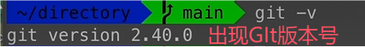

即安装成功

#### 打开 GIt Bash Here

在资源管理器中右键

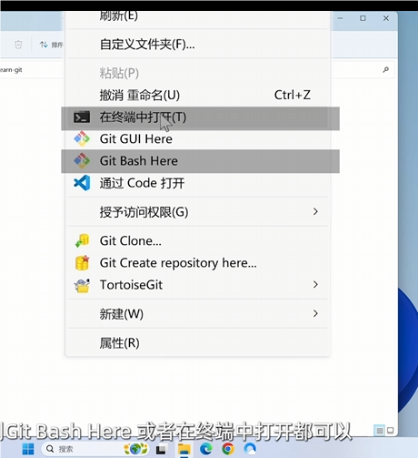

点击 GIt Bash Here 打开

### 2、配置用户名邮箱

#### 用户名：

如果用户名中有空格需要用双引号，没有则不需要

命令：git config --global user.name "用户名“

#### 邮箱：

命令：git config --global user.email 邮箱


#### 保存密码：

命令：git config --global credential.helper store

#### 查看配置信息：

命令：git config --global --list

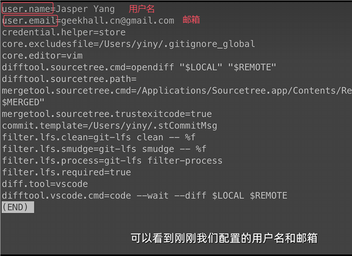

## 三、创建仓库

### 1、创建本地仓库

首先，找到一个合适位置创建空目录，在资源管理器合适位置，右键，点击 GIt Bash Here 打开

#### 创建目录

命令：mkdir  目录名

进入目录：cd 目录名

#### 创建本地仓库

命令：git init

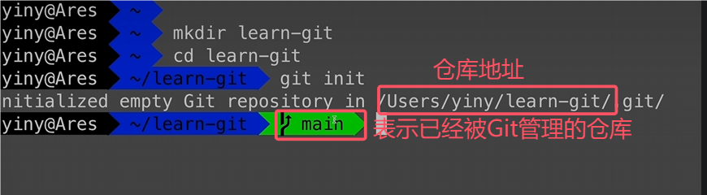

初始化一个空的Git仓库是一个非常基础且重要的步骤。这个过程通常使用`git init`命令来完成。该命令会创建一个新的隐藏目录`.git`，其中包含了一些用于跟踪代码变更的元数据和配置文件

#### 查看本地仓库是否有 .git目录

命令：ls -a

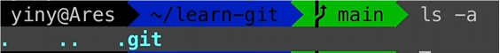

查看有.git目录，则创建成功

.git目录如果被删除，则该目录不在是本地仓库

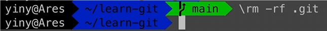

### 2.克隆远程仓库

命令：git clone 仓库链接

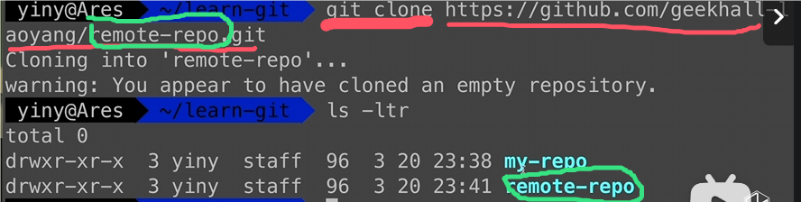

##  四、git的工作区域和文件状态

###   1、git的本地管理区域


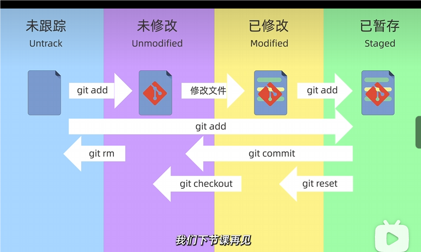


## 五、添加文件和提交文件

### 1、查看仓库文件状态

```
git status
```

创建一个文本文件：

```git
echo  ”这是第一个文件“ > file1.txt
```

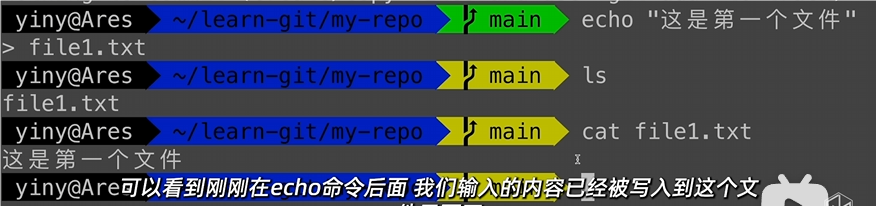

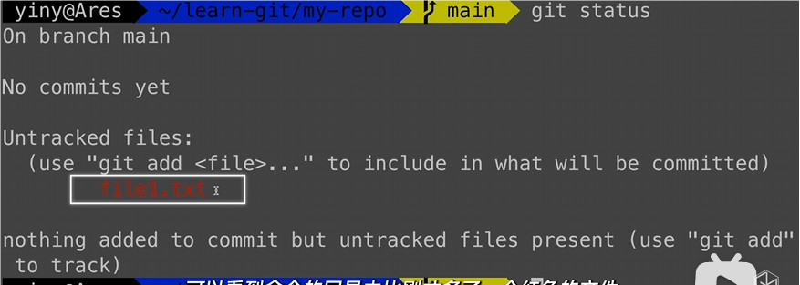

红色为 未跟踪

#### 添加文件到暂存区

```
git add 文件名
```

```
git add . //将所有文件添加到暂存区
```

```
git add *.txt  //使用通配符，将后缀为.txt的文件添加到暂存区
```

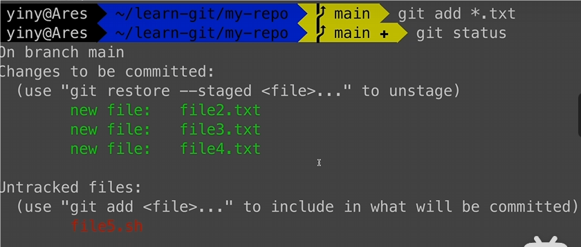

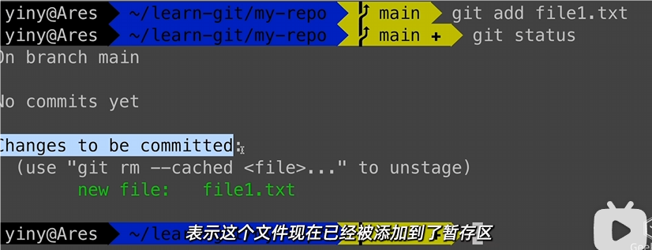

文件已经添加到暂存区会变为绿色

#### 查看暂存区内容

```
git ls-files
```

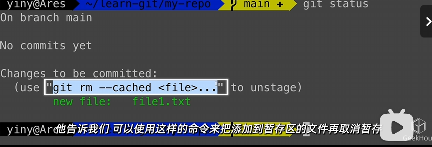

### 2、将文件提交到本地仓库中

#### 文件提交

只有在暂存区中的文件会被提交

```
git commit -m "提交说明"
```

#### 查看提交记录

```
git log
```

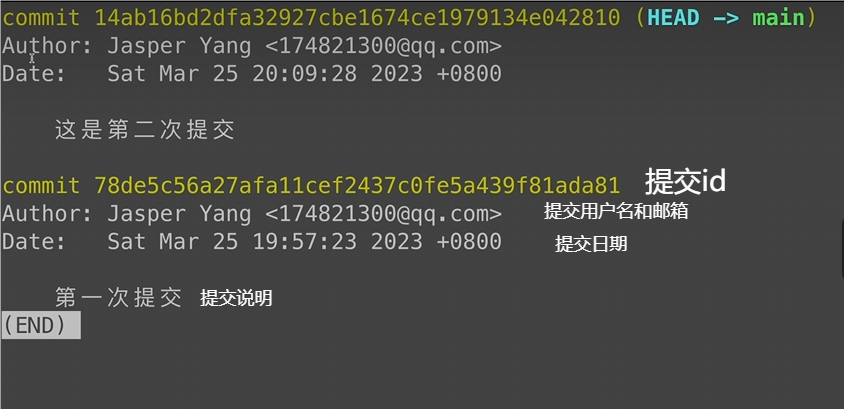

#### 查看简洁的提交信息

```
git log --oneLine
```

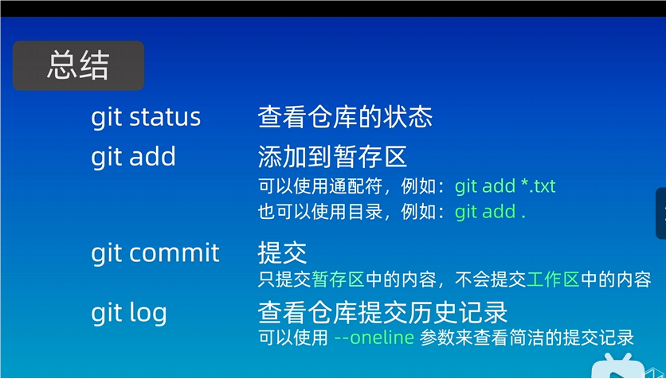

## 六、git reset 回退版本，三种模式

### 1、三种模式


打勾：表示保留

打叉：清空


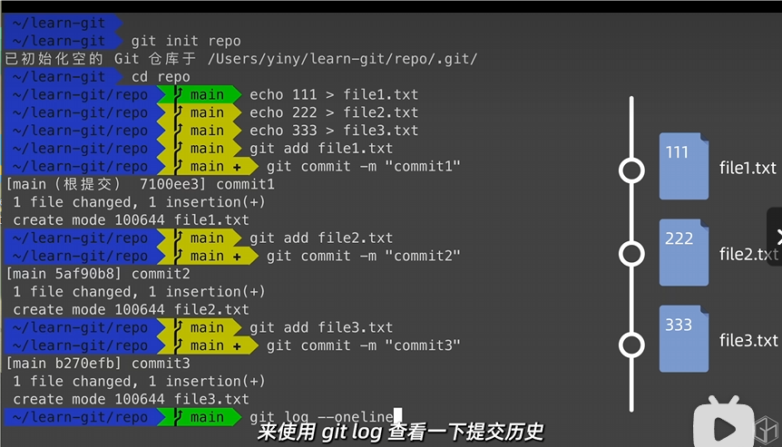


### 2、回退版本

#### git reset --soft

```
git reset --soft 回退版本id
```

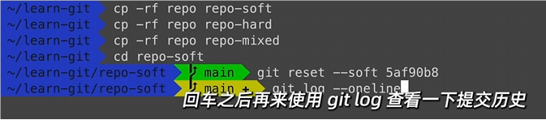

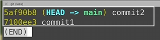

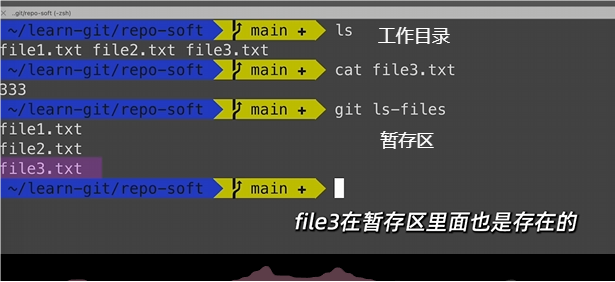

#### git reset --hard

```
git reset --hard  回退版本id/HEAD^为回退上一个版本
```

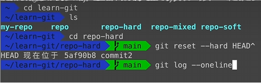

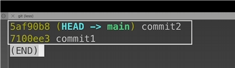

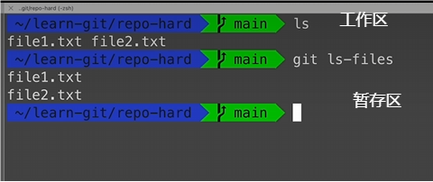

#### git reset  

```
git reset --HEAD^  //回退到上一个版本
```

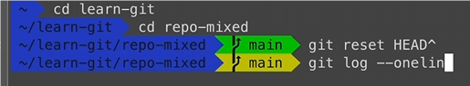

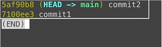

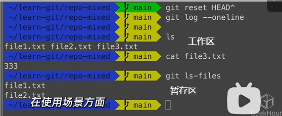

如果觉得之前提交的多个版本，但是又觉得这些提交没有太多意义，可以合并成一个版本的时候可以通过

git reset --soft 可以直接提交

git reset  退回之后重新添加到暂存区，然后提交

git reset --hard 谨慎操作

如果误操作可以查看操作历史

#### 查看操作历史

```
git reflog
```

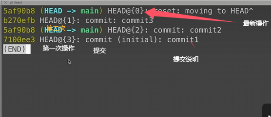

##  七、使用git diff 查看版本差异

## 

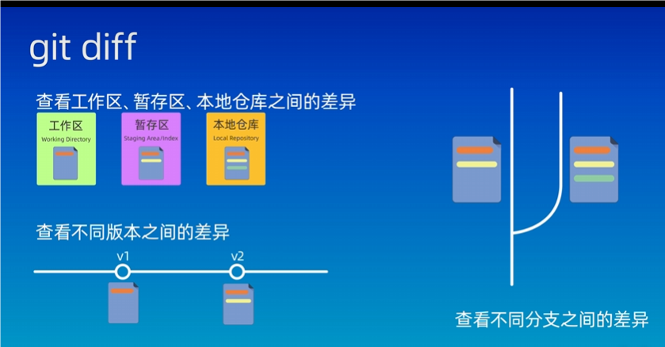

### 1、工作区   与  暂存区    的差异：git  diff

默认查看工作区与暂存区的差异

显示差异的详细信息

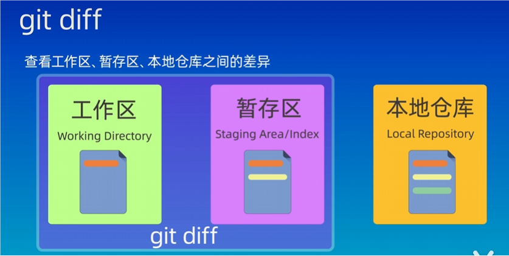

##### 案例

版本记录

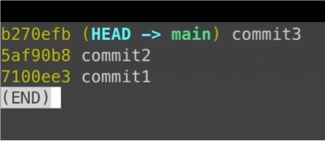

原提交文件内容

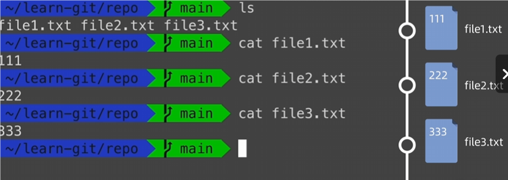

更改本地文件的内容

删除：333、添加 ：一键三联了吗？

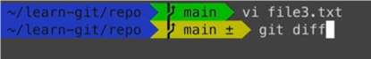

使用 git diff  查看差异

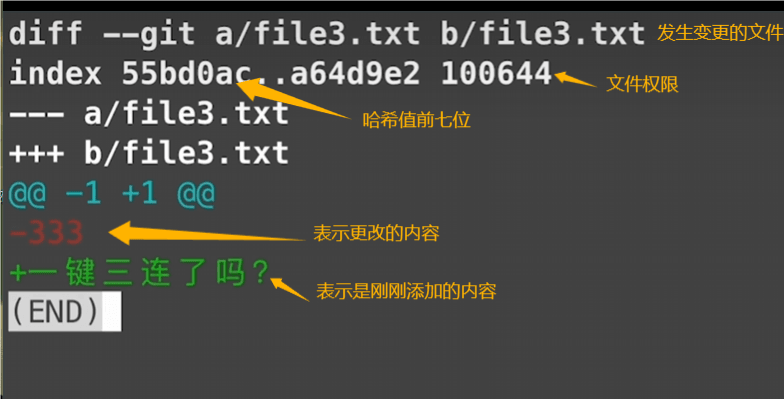

把全部文件添加到暂存区

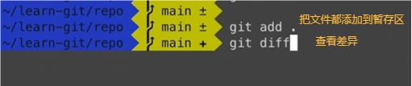

查看工作区与暂存区的差异显示无内容


### 2、工作区   与   版本区    的差异：git diff HEAD


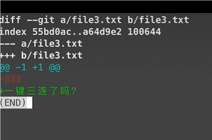

### 3、暂存区   与   版本区的差异：git diff   --cached


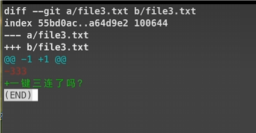

### 4、   版本    与   版本    之间的差异：git diff 提交id   提交id

先查看提交历史版本


##### 查看版本与上一个版本之间的差异：git diff 提交id   HRAD

##### 

##### 版本与上一个版本之间的差异：git diff HEAD~  HRAD

HRAD：表示第二个版本

HEAD~  或HEAD^：表示当前最新版本

HEAD~数字：表示最新版本之后的第几个版本

##### 加上文件名后只会查看该文件的差异 

```
git diff HEAD~  HRAD   文件名
```

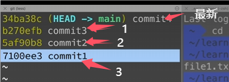

##### 总结

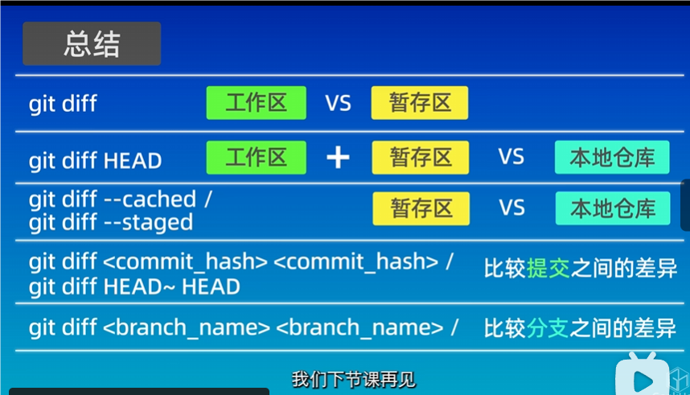

## 八、git rm 删除文件

### 1、删除本地文件： rm  文件名

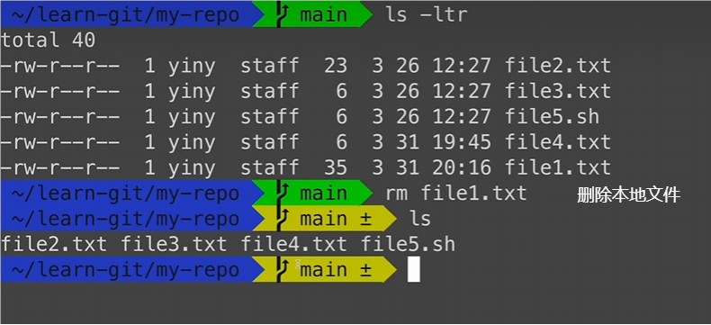

查看仓库状态

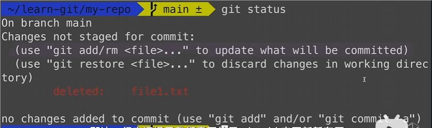

查看暂存区内容

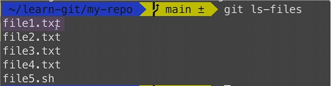

把本地文件添加到暂存区

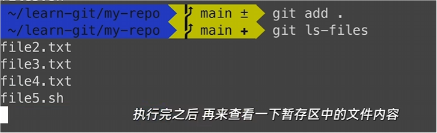

### 2、删除暂存区内容：git rm  文件名

 删除暂存区文件；工作区文件也会被删除

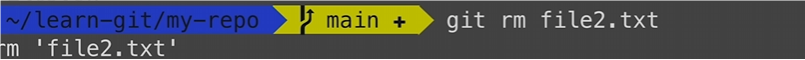

查看版本库状态

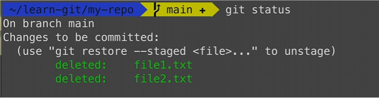

查看工作区文件和暂存区

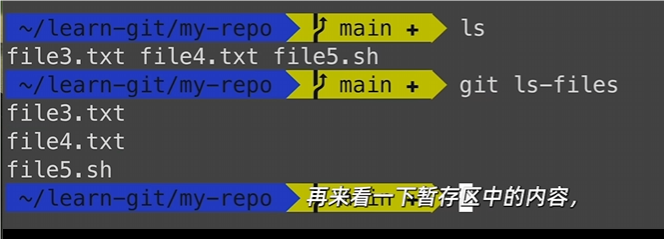

### 3、删除仓库文件：git rm --cached 文件名

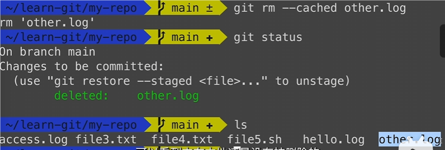

#### 最后记得提交到版本库中

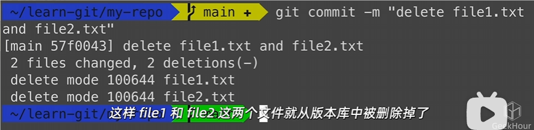

### 总结

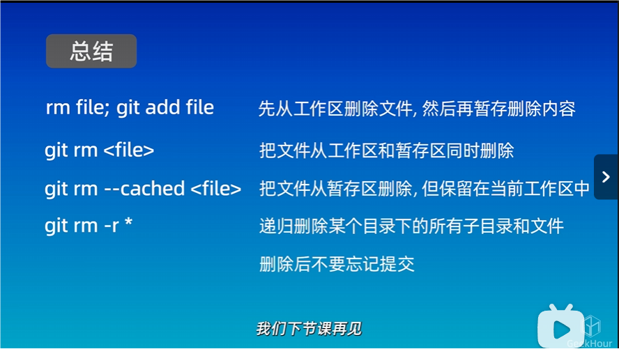

## 九、.gitignore 忽略文件


### .gitignore 忽略文件的匹配规则

从上到下逐行匹配，每一行表示一个忽略模式


#### 1、创建一个日志文件


#### 2、在创建一个日志文件


#### 3、添加暂存区和提交版本


#### 4、查看仓库文件


编辑.gitignore 忽略文件


#### 5、在.gitignore 忽略文件使用聚合函数


#### 6、添加日志文件


#### 7、提交版本，查看本地仓库内容


#### 修改工作目录日志文件


#### git diff 查看工作区与暂存区的差异


如果文件已经被提交到仓库中，需要先删除仓库中的文件

#### 删除仓库文件


#### 提交版本

.log文件如何修改都不会被纳入版本控制中，就是忽略了.log文件


### 查看暂存区文件：git diff --cached

### 工作目录中的空文件夹不会被纳入管理

## 十、SSH配置和克隆仓库

### 1、GitHub创建仓库


### 2、配置SSH密钥


它会在我们用户根目录的点SSH日录下生成一个id_rsa的密钥文件


回车


进入  .pub文件


如果你是第一次创建SSH密钥

而且在创建密钥的时候也没有修改过默认的文件名的话

### SSH密钥的配置到这里就完成了

那如果你也像我一样

刚刚指定了一个新的文件名

那么还需要增加一步配置


### 3、克隆远程仓库：git clone   github链接


克隆成功

### 4、远程仓库与本地仓库的关系

我们从第一节课就了解到，Git这是一种分布式的版本控制系统，本地仓库和远程仓库是两个仓库。他们之间是相互独立的。我们可以在本地仓库中做任何修改。但是，这些修改并不会影响到远程仓库。同样，远程仓库的修改影响到我们本地仓库。因此，我们需要一种机制来同步本地仓库和远程仓库的修改内容。让他们的状态保持一致，那这个同步的过程就涉及到了Git中两个新的命令。

#### 5、push：推送到远程仓库

#### 6、pull：拉取到本地仓库

这两个命令的含义和他的名字一样，非常形象，push表示推送，pull并表示拉取。push就是把本地仓库的修改推送给远程仓库。pull，就是把远程仓库的修改拉取到本地仓库


### 推送仓库：git push

